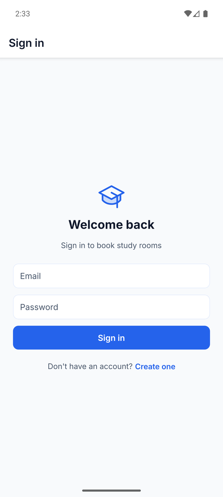
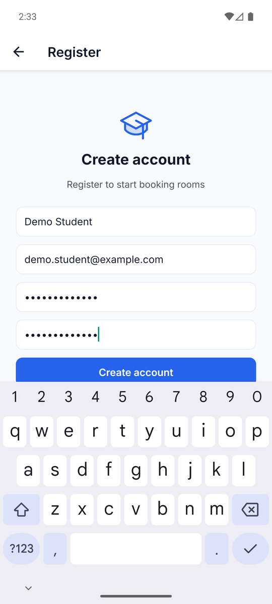
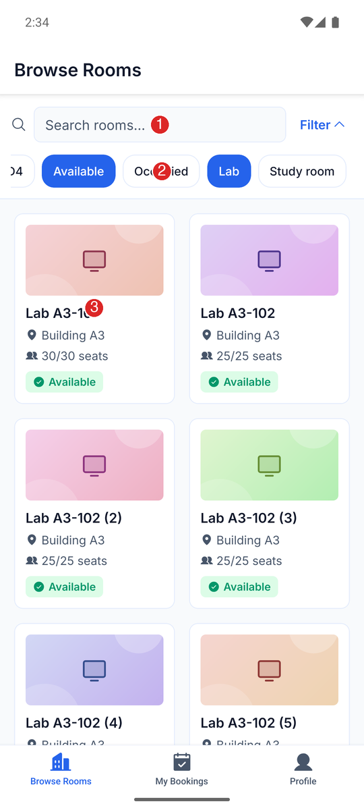
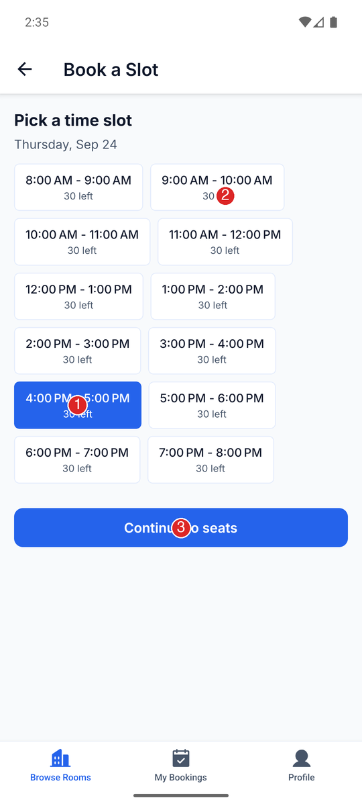
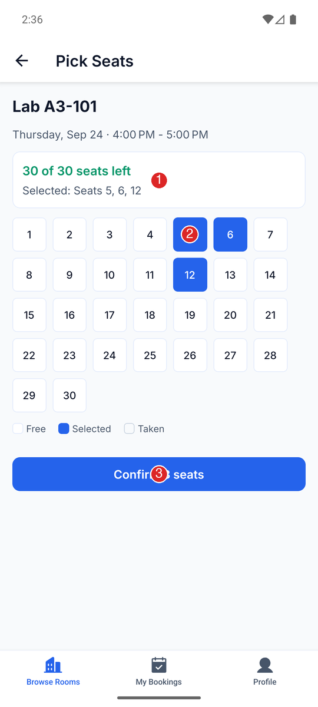
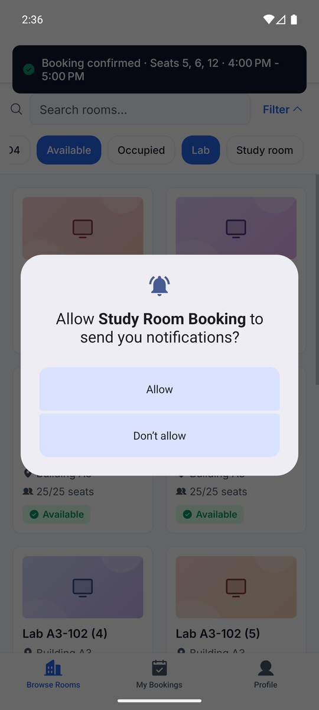
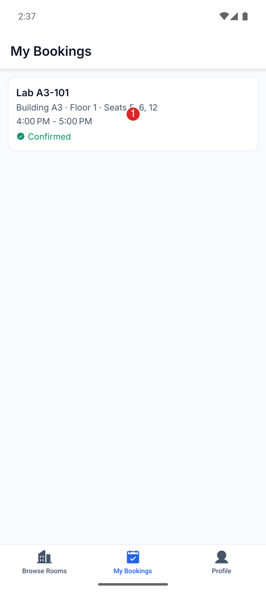
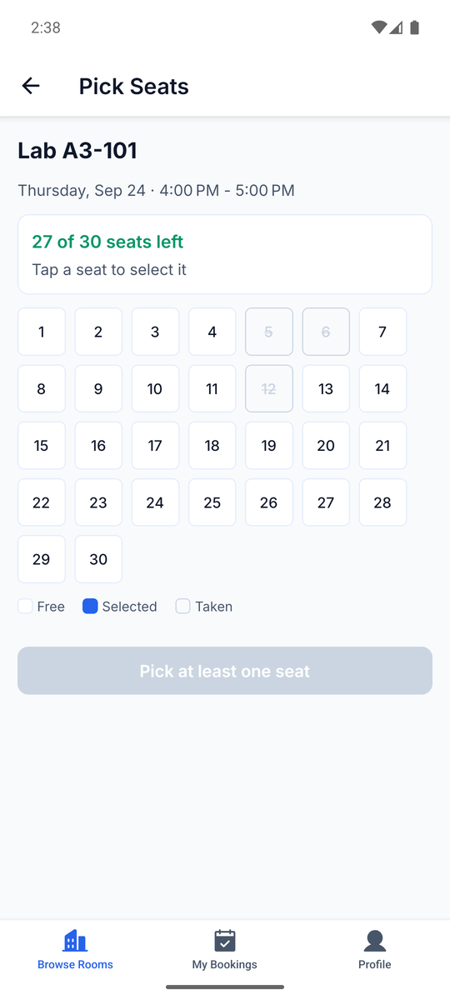
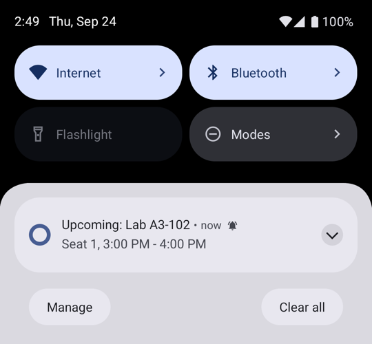
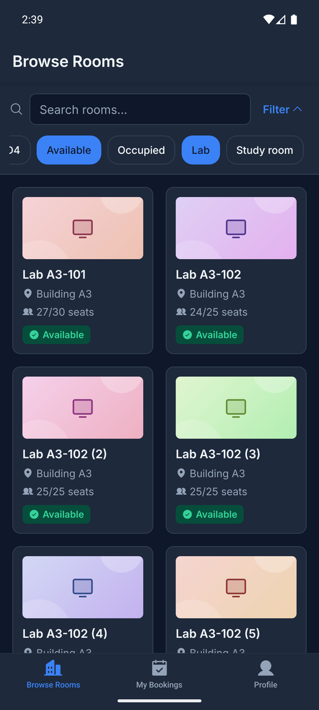

# VKU – Phát triển ứng dụng đa nền tảng
## BÁO CÁO KỸ THUẬT NGẮN – MINI-PROJECT

**Đề tài:** Mini-Project 2 – Real-time Study Room Booking App (ứng dụng đặt phòng học / phòng lab)
**Ngày:** 24/09/2026

---

## 1. Thông tin nhóm

| Mục | Nội dung |
|---|---|
| Tên nhóm | `TODO: điền` |
| Lớp | `TODO: điền` |

| # | Họ tên | MSSV | Vai trò | Đóng góp (%) |
|---|---|---|---|---|
| 1 | `TODO` | `TODO` | `TODO` | `TODO` |
| 2 | `TODO` | `TODO` | `TODO` | `TODO` |

> Họ tên, MSSV, vai trò, % đóng góp chưa có thông tin nên để trống có chủ đích.

---

## 2. Liên kết sản phẩm

| Mục | Liên kết |
|---|---|
| Mã nguồn (GitHub) | https://github.com/sunsanti/DNT_week6 |
| Live demo (GitHub Pages, cài được như PWA) | https://sunsanti.github.io/DNT_week6/ |
| File APK Android (GitHub Release) | https://github.com/sunsanti/DNT_week6/releases/latest (`room-booking-app.apk`, ~42 MB, ký debug) |
| Video demo | Không có |

**Công nghệ:** React Native + Expo SDK 57 (managed), TypeScript strict, React Navigation 7 (Bottom Tabs + Native Stack), Zustand (state phía client), TanStack Query (state phía server), Firebase Auth + Firestore (tài khoản), expo-notifications (nhắc lịch).

---

## 3. Cấu trúc thư mục

```
room-booking-app/
├── App.tsx                     # Điểm vào: nạp font, theo dõi phiên đăng nhập, Toast
├── app.json / app.config.js    # Cấu hình Expo (tên app, package, baseUrl cho GitHub Pages)
├── firebase.json, firestore.rules   # Cấu hình Firebase + luật bảo mật (mỗi user chỉ đọc/ghi doc của mình)
├── .env.local                  # Khóa Firebase web (KHÔNG commit, đã .gitignore)
├── public/                     # File cho bản web/PWA: manifest, service worker, icon
├── assets/                     # Icon, splash của app
├── tests/                      # 46 unit/component test (Jest)
├── .github/workflows/deploy-web.yml   # CI: kiểm tra + build web + deploy GitHub Pages
└── src/
    ├── navigation/             # Điều hướng
    │   ├── RootNavigator.tsx   #   Chưa đăng nhập -> AuthStack, đã đăng nhập -> MainTabs
    │   ├── MainTabs.tsx        #   3 tab: Browse Rooms / My Bookings / Profile
    │   ├── BrowseRoomsStack.tsx, MyBookingsStack.tsx, ProfileStack.tsx, AuthStack.tsx
    │   └── types.ts            #   Kiểu tham số cho từng màn hình
    ├── screens/                # Các màn hình
    │   ├── auth/               #   LoginScreen, RegisterScreen
    │   ├── browse-rooms/       #   RoomListScreen -> RoomDetailScreen -> TimeSlotBookingScreen -> SeatSelectionScreen
    │   ├── my-bookings/        #   MyBookingsListScreen, BookingDetailScreen (hủy đặt)
    │   └── profile/            #   ProfileScreen (đăng xuất)
    ├── components/             # Thành phần UI tái sử dụng
    │   ├── RoomCard/           #   Thẻ phòng (memo) + skeleton loading
    │   ├── FilterChip/, TimeSlotPicker/, SeatMap/, RoomInfo/, AuthForm/, Toast/, RoomIllustration/
    ├── store/                  # Zustand: useFilterStore, useBookingDraftStore, useSessionStore, useToastStore
    ├── services/
    │   ├── api/                #   Hook TanStack Query (useRooms, useCreateBooking, ...) + mock/db.ts (CSDL giả trong bộ nhớ)
    │   ├── firebase.ts, auth.ts#   Đăng ký / đăng nhập / phiên đăng nhập
    │   └── reminders.ts        #   Đặt lịch thông báo nhắc trước 15 phút
    ├── utils/                  # overlapCheck (chống trùng), applyFilters, generateDaySlots, reminderTime, ...
    ├── types/                  # Room, Booking, TimeSlot, FilterState
    ├── hooks/, constants/      # useDebouncedValue, theme (màu sáng/tối, font, spacing)
```

Luồng dữ liệu: **Screen -> hook TanStack Query -> `services/api/mock/db.ts`**. Trạng thái tạm (bộ lọc, khung giờ/ghế đang chọn, người dùng) nằm trong **Zustand**.

---

## 4. Danh sách tính năng

| Yêu cầu | Trạng thái | Ghi chú |
|---|---|---|
| Duyệt phòng, tìm kiếm + chip lọc (trạng thái, loại phòng) | Xong | `RoomListScreen`, state ở `useFilterStore` |
| Danh sách `FlatList`, thẻ phòng `memo` | Xong | Có skeleton khi tải. **Chưa đo 60 fps trên máy thật.** |
| Đặt 2 bước: chọn khung giờ rồi chọn ghế | Xong | Màn ghế hiển thị "N of M seats left" |
| Chống đặt trùng | Xong | Ghế đã có người đặt trong khung giờ giao nhau thì không chọn được; một người không giữ 2 lịch trùng giờ; phòng "occupied" không đặt được. Kiểm tra lại ở tầng API (mock), không chỉ ở UI. |
| State toàn cục bằng Zustand | Xong | filter, bản nháp đặt chỗ, phiên đăng nhập, toast |
| My Bookings + hủy đặt | Xong | Hiển thị phòng, tòa, tầng, ghế, giờ, trạng thái |
| Thông báo nhắc lịch (trước 15 phút) | Xong, chỉ app Android | Không chạy trên web hoặc Expo Go. Xem ảnh 9. |
| Đăng ký / đăng nhập / giữ đăng nhập | Xong | Firebase Auth (email + mật khẩu), hồ sơ ở Firestore `users/{uid}` |
| Dark mode + giao diện responsive | Xong | Theo giao diện hệ thống; bản web giới hạn rộng 480 px |
| Live demo cài được trên điện thoại | Xong | PWA trên GitHub Pages + file APK |
| Cập nhật real-time giữa nhiều người dùng | **Chưa làm** | Phòng và lượt đặt nằm trong CSDL giả trong bộ nhớ. Chỉ tài khoản nằm trên Firebase. |
| Lưu lượt đặt sau khi tắt app | **Chưa làm** | Cùng lý do trên |

Kiểm tra tự động: `tsc --noEmit` sạch, 46 test Jest đều qua (logic trùng giờ/ghế, bộ lọc, mock DB, validate đăng nhập, giờ nhắc, theo dõi phiên, `RoomCard`, `FilterChip`).

---

## 5. Ảnh chụp màn hình

Tất cả ảnh chụp từ file APK bản release chạy trên máy ảo Android (Pixel 8, 1080x2400). Số đỏ đánh dấu các điểm được giải thích bên dưới ảnh.

### Ảnh 1 – Đăng nhập


Form email + mật khẩu, có kiểm tra dữ liệu nhập. Lần mở app sau, phiên đăng nhập được khôi phục tự động.

### Ảnh 2 – Đăng ký


Tạo tài khoản qua Firebase Auth. Form cuộn được và không bị bàn phím che.

### Ảnh 3 – Duyệt phòng và lọc


1. Ô tìm kiếm.
2. Các chip lọc (đang chọn *Available* + *Lab*).
3. Thẻ phòng trong `FlatList` 2 cột, có số ghế còn lại và nhãn trạng thái.

### Ảnh 4 – Bước 1: chọn khung giờ


1. Khung giờ đang chọn.
2. Số ghế còn trống của khung giờ đó.
3. Nút "Continue to seats" chỉ bật sau khi đã chọn giờ.

### Ảnh 5 – Bước 2: chọn ghế


1. Dòng "N of M seats left" cho khung giờ đã chọn.
2. Các ghế đang chọn (màu xanh).
3. Nút xác nhận hiển thị số ghế.

### Ảnh 6 – Xin quyền thông báo và toast xác nhận


Sau khi xác nhận, hiện toast "Booking confirmed". Ở lần đặt đầu tiên, app xin quyền gửi thông báo.

### Ảnh 7 – My Bookings


1. Thẻ lượt đặt: phòng, tòa, tầng, ghế, giờ, trạng thái.

### Ảnh 8 – Chống đặt trùng ghế


Ghế 5, 6, 12 đã bị đặt trong cùng khung giờ nên bị vô hiệu hóa và gạch ngang. Bộ đếm giảm từ 30 xuống 27.

### Ảnh 9 – Thông báo nhắc lịch


"Upcoming: Lab A3-102, Seat 1, 3:00 PM - 4:00 PM". Lịch nhắc đặt lúc 14:45 (trước giờ đặt 15 phút). Android gửi lúc khoảng 14:49 vì hệ thống gộp các alarm không chính xác (`dumpsys alarm` cho thấy cửa sổ trễ ~4,5 phút).

### Ảnh 10 – Dark mode


Cùng màn hình khi hệ thống bật giao diện tối.

---

## 6. Khó khăn và cách giải quyết

1. **Bàn phím che form (Android edge-to-edge).** Ở màn Đăng ký, bàn phím che các ô nhập và trang không cuộn được. Phát hiện khi test trên máy ảo. Đã sửa bằng form cuộn được đặt trong `KeyboardAvoidingView behavior="padding"`.
2. **APK build ra dùng sai cấu hình Firebase.** Gradle cache bản JS bundle và bỏ qua `.env.local` mới, nên APK vẫn dùng giá trị cũ. Đã ép build lại bundle (`createBundleReleaseJsAndAssets --rerun`) và kiểm tra bằng cách tìm project id trong bundle sau khi build.
3. **Lỗi nhỏ khác:** `expo-notifications` báo lỗi trong Expo Go trên Android (nay import lười và bỏ qua ở Expo Go); vòng quay khởi động có thể treo với tài khoản đã xóa khi mạng chậm (nay kiểm tra phiên tối đa 4 giây); gradient SVG biến mất khi các màn hình xếp chồng do trùng id (nay mỗi instance có id riêng).

**Hạn chế và hướng phát triển:** chuyển phòng và lượt đặt sang Firestore để có real-time và lưu trữ lâu dài; đo hiệu năng danh sách trên máy thật; APK hiện ký debug.
